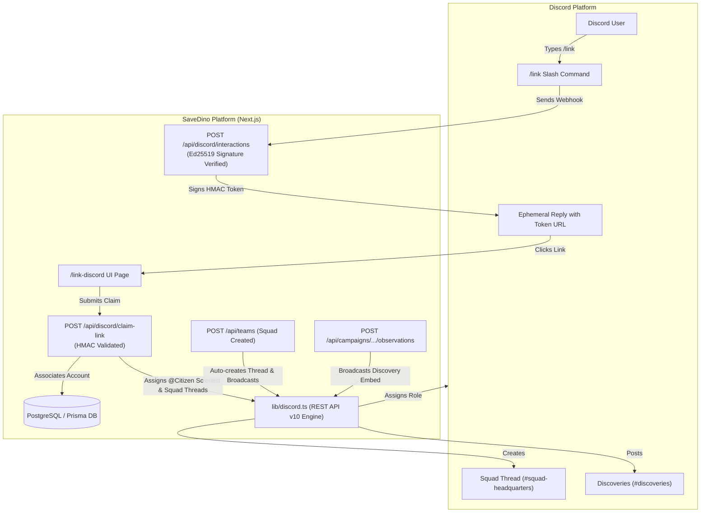

# SaveDino Discord System Documentation 🪐

Welcome to the comprehensive technical and operational documentation for the **SaveDino Discord Integration & Community Server**.

SaveDino features a **100% free, serverless, automated Discord integration** built on Discord REST API v10, Ed25519 signature verification, Better-Auth OAuth2, Dyno Bot ticketing, and automated squad workspace generation.

---

## 📚 Documentation Index

| Doc                                                                                | Topic                    | Description                                                                                                           |
| :--------------------------------------------------------------------------------- | :----------------------- | :-------------------------------------------------------------------------------------------------------------------- |
| [**01. Developer Portal & Bot Setup**](./01-developer-portal-and-bot-setup.md)     | Setup & Credentials      | How to create the Discord App, configure Bot Token, Public Keys, OAuth2, and `.env` variables.                        |
| [**02. Architecture & Codebase APIs**](./02-architecture-and-apis.md)              | Technical Implementation | Deep dive into `lib/discord.ts`, Ed25519 signature validation, HMAC tokens, and Next.js Route Handlers.               |
| [**03. Server Structure & Channel Layout**](./03-server-structure-and-channels.md) | Channel Architecture     | Complete hierarchy of categories, channels, permissions, and copy-paste channel starter templates.                    |
| [**04. Roles & Permissions Matrix**](./04-roles-and-permissions-matrix.md)         | Role Hierarchy           | Server roles, permission overrides, critical Bot role ordering, and dynamic campaign role assignment.                 |
| [**05. Dyno Bot & Support Desk Setup**](./05-dyno-and-support-desk-setup.md)       | Support & Moderation     | Setting up the Ticket Support Desk embed panel, intake forms, transcripts, and AutoMod banned words list.             |
| [**06. Maintenance & Troubleshooting**](./06-maintenance-and-troubleshooting.md)   | Operations & Debugging   | How to register slash commands, debug webhook signature issues, fix 403 Forbidden errors, and launch campaigns.       |
| [**07. Copy-Paste Pack & Onboarding Kit**](./07-server-copy-paste-pack.md)         | Copy-Paste Asset Pack    | Ready-to-use role colors, channel topics, starter messages, rules, guides, and Discord Community Onboarding settings. |

---

## 🏗️ System Architecture Overview

---

## 💡 Key Architectural Principles

1. **$0 Operating Cost (Serverless REST API)**:
   - Does not run a persistent Node.js WebSocket gateway bot (no container or VPS needed).
   - All outgoing operations (messages, embeds, threads, roles) run through Discord's REST API v10 with standard `fetch` requests.
2. **Cryptographic Ed25519 Security**:
   - Discord interaction webhooks are validated using raw buffer cryptographic verification against `DISCORD_PUBLIC_KEY` with standard ASN.1 SPKI headers.
3. **Signed One-Time Link Tokens**:
   - Account linking utilizes signed SHA-256 HMAC tokens with a 15-minute TTL to prevent spoofing or replay attacks.
4. **Automated Campaign & Squad Sync**:
   - Creating a squad immediately spawns an isolated workspace thread and invites the squad leader.
   - Linking an account automatically retroactively syncs campaign roles and squad thread memberships.
